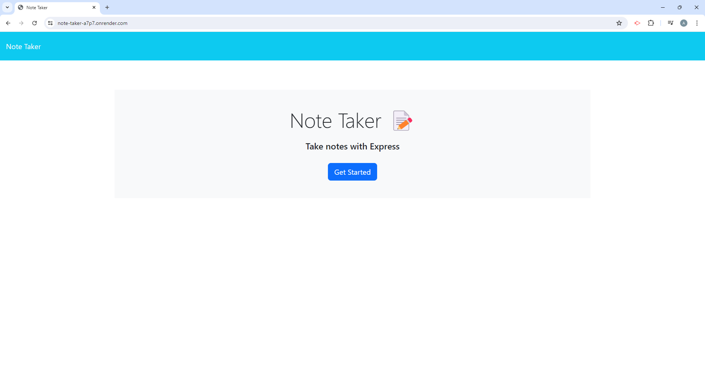

# note-taker

## Description

The goal of this project was to create a note taking application that would utilize Express.js back end functionality to persistently save the notes in a JSON file. The final application would then be uploaded to Render.

## Installation

Render handles any instilation that needs to be done to run the application.

## Usage

Once you are on the homepage press the get started button to be directed to the notes page. Once on the notes page you can add new notes by adding text to the text fields on the right and then hitting the save note button that appears. You can also bring up a saved note by clicking on it in the list on the left side. Lastly you can delete a note by hitting the trash can symbol next to each note title.

Below are screenshots showing the homepage and the notes page with several added notes.

Link to the deployed application:
[Deployed website](https://note-taker-a7p7.onrender.com/)

## Credits

N/A

## License

N/A

## Contribute

N/A